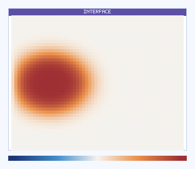
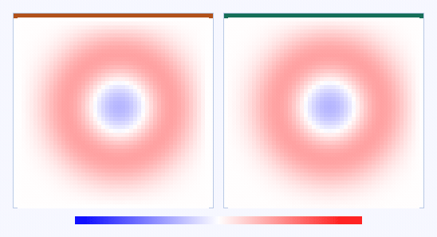
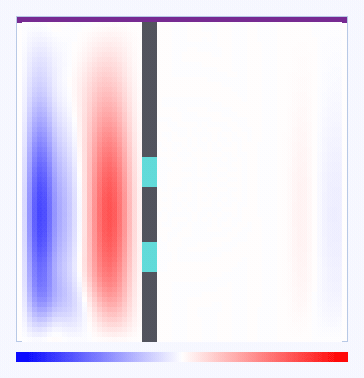
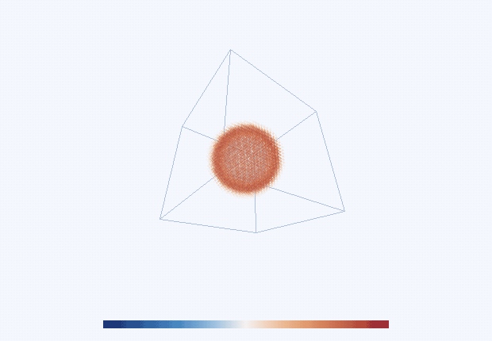

# wavefront-simulation

Scientific N-dimensional wave simulation library in C++20 with interchangeable solver modes, symbolic constitutive laws, deterministic CPU execution, exact-reference hooks, and Python bindings.

## Simulation Visualization

All animations below are generated by running the library itself.

### 1) Interchangeable Solver Modes (same problem setup)

Left to right: `LinearApprox`, `NonlinearContinuum`, `MicroSurrogate`.


### 2) Interface Reflection / Transmission Example

Single linear solver with a smooth impedance jump in `x_0`, showing reflected and transmitted fronts.



### 3) Boundary Behavior Example

Left: periodic boundaries (re-entering energy). Right: PML boundaries (absorbing edges).



### 4) Double-Slit Experiment

Single source on the left, opaque wall in the middle (dark gray) with two open slits (cyan), and downstream interference fringes behind the slits.



### 5) 3D Wavefield (Volumetric Perspective)

Full 3D simulation rendered as a perspective volume (not slice planes), with a rotating camera to show depth.



Regenerate all GIFs with:

```bash
PYTHONPATH=build/python python3 examples/generate_readme_gifs.py
```

Note: GIF export requires `ffmpeg` on `PATH`.

## Features

- Runtime interchangeable modes: `LinearApprox`, `NonlinearContinuum`, `MicroSurrogate`
- Compile-time solver API: `SolverND<N, Scalar, Mode>`
- N-D Cartesian domains and configurable spatial order (2nd / 4th)
- Boundary operators: Dirichlet, Neumann, Robin, Periodic, Impedance, PML
- Interface physics helpers for reflection/refraction/mode-conversion calculations
- Symbolic expression parser/compiler for medium and source terms
- Exact-reference infrastructure with `limitless` in `ExactReference` mode
- CMake package export and pybind11 Python module
- Unit/integration/verification/benchmark test matrix

## Build

```bash
cmake -S . -B build -DWAVEFRONT_BUILD_TESTS=ON -DWAVEFRONT_BUILD_PYTHON=ON
cmake --build build -j
ctest --test-dir build --output-on-failure
```

## Python wheel build

```bash
python -m pip install -U build
python -m build
```

## License

GPL-3.0-only (aligned with `limitless`). See `/Users/gergely.toth/Work/wavefront-simulation/LICENSE`.

## Documentation

- `/Users/gergely.toth/Work/wavefront-simulation/docs/API_REFERENCE.md`
- `/Users/gergely.toth/Work/wavefront-simulation/docs/MATHEMATICAL_DERIVATIONS.md`
- `/Users/gergely.toth/Work/wavefront-simulation/docs/VALIDATION_REPORT.md`
- `/Users/gergely.toth/Work/wavefront-simulation/docs/tutorial_nd_setup.md`
- `/Users/gergely.toth/Work/wavefront-simulation/docs/tutorial_mode_switching.md`
- `/Users/gergely.toth/Work/wavefront-simulation/docs/tutorial_precision_reference.md`
