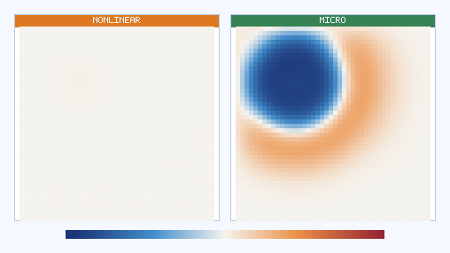
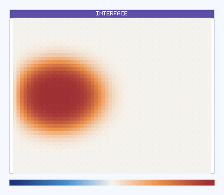
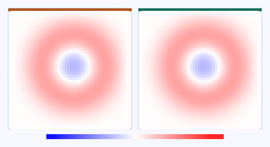
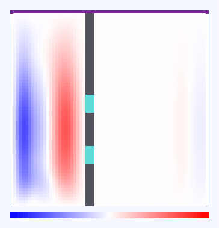
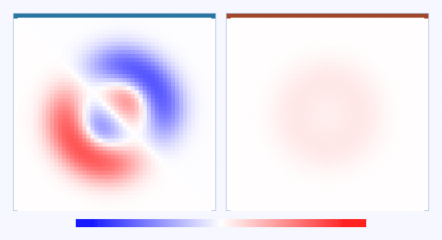
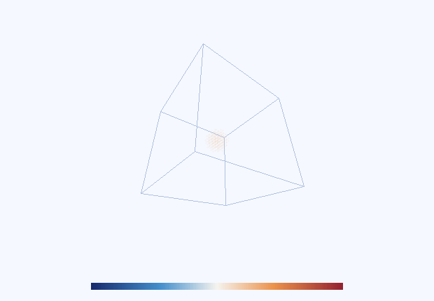
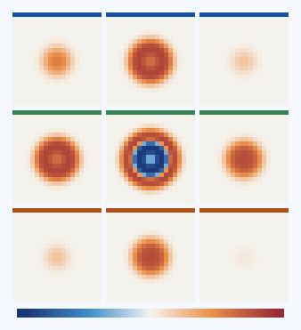
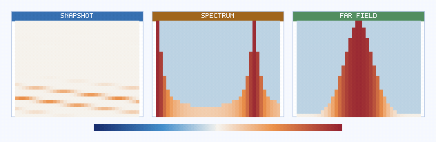

# wavefront-simulation

Scientific N-dimensional wave simulation library in C++20 with interchangeable solver modes, symbolic constitutive laws, deterministic CPU execution, exact-reference hooks, and Python bindings.

## Simulation Visualization

All animations below are generated by running the library itself.
The generator enforces scenario-level physical checks and writes quantitative results to
`docs/assets/_checks/validation-metrics.json`.

### 1) Interchangeable Solver Modes (same problem setup)

Left to right: `LinearApprox`, `NonlinearContinuum`, `MicroSurrogate`.


### 2) Mode Residual Maps

Linear baseline subtracted from the higher-physics modes to highlight where
`NonlinearContinuum` and `MicroSurrogate` depart from the same initial-value problem.



### 3) Interface Reflection / Transmission Example

Single linear solver with a smooth impedance jump in `x_0`, showing reflected and transmitted fronts.



### 4) Boundary Behavior Example

Left: periodic boundaries (re-entering energy). Right: PML boundaries (absorbing edges).



### 5) Double-Slit Experiment

Left: instantaneous field from a single source on the left with an opaque wall in the middle
(dark gray) and two open slits (cyan). Right: log-integrated downstream intensity, exposing
the interference fringe pattern that builds up behind the slits.



### 6) Longitudinal Wave (Compressional / P-wave) Example

Left: longitudinal 2-component displacement field rendered as its divergence
(`∇·u`), exposing alternating compression and rarefaction bands.
Right: transverse scalar wave under the same source and medium, for comparison.



### 7) 3D Wavefield (Volumetric Perspective)

Full 3D simulation rendered as a perspective volume (not slice planes), with a rotating camera to show depth.



### 8) 4D Wavefield (Hyperslice Grid)

A 4-D acoustic wave launched from a point source at the centre of [0,1]⁴.  
Because wave fronts in 4-D expand as a 3-sphere (the surface of a 4-ball),
each 2-D cross-section at a fixed *(x₂, x₃)* position shows a circular arc
whose radius depends on the slice distance from the source.

The 3 × 3 grid visualises this directly:
- **rows** → three x₂ levels: ¼, ½, ¾ of the domain (stripe colour encodes the level)
- **columns** → three x₃ levels: ¼, ½, ¾ of the domain
- The **centre panel** (x₂ = ½, x₃ = ½) cuts through the equator of the
  3-sphere and shows the largest wavefront ring; corner panels reveal
  progressively smaller cross-sections, exposing the 4-D geometry.



### 9) Monitor / Spectrum / Far-Field Analysis

Left: full-field magnitude snapshot from `field_snapshot()`. Middle: probe spectrum from
`probe_spectrum()`. Right: near-to-far angular response from `far_field_pattern()`, with
geometry-enabled propagation and monitor accumulation enabled throughout the run.



Regenerate all GIFs with:

```bash
PYTHONPATH=build/python python3 examples/generate_readme_gifs.py
```

Note: GIF export requires `ffmpeg` on `PATH`.

The GIF pipeline is also the easiest end-to-end smoke test for the higher-level APIs:
geometry regions, monitor definitions, snapshots, spectra, far-field results, and validation
metrics are all exercised in one place by `examples/generate_readme_gifs.py`.

## Features

- Runtime interchangeable modes: `LinearApprox`, `NonlinearContinuum`, `MicroSurrogate`
- Solver families: `TimeDomain`, `FrequencyDomain`, `AngularSpectrum`
- Wave families: transverse scalar propagation and longitudinal vector propagation
- Compile-time solver API: `SolverND<N, Scalar, Mode>`
- N-D Cartesian domains and configurable spatial order (2nd / 4th)
- Boundary operators: Dirichlet, Neumann, Robin, Periodic, Impedance, PML
- Interface physics helpers for reflection/refraction/mode-conversion calculations
- Geometry/material regions: box, sphere, and layered overrides on top of symbolic background media
- Result APIs: full-field snapshots, probe histories/spectra, surface flux monitors, far-field patterns
- Bulk data I/O: CSV field export plus checkpoint save/load
- Complex phasor snapshots and backend-selection diagnostics
- Built-in material presets (including honey, hyperhoney, oobleck, ferrofluid, aerogel, plasma, metamaterial, and dense compact-object media), parameter sweeps, finite-difference gradients, and plotting helpers
- Symbolic expression parser/compiler for medium and source terms
- Exact-reference infrastructure with `limitless` in `ExactReference` mode
- CMake package export and pybind11 Python module
- Unit/integration/verification/benchmark test matrix

## Build

```bash
cmake -S . -B build -DWAVEFRONT_BUILD_TESTS=ON -DWAVEFRONT_BUILD_PYTHON=ON
cmake --build build -j
ctest --test-dir build --output-on-failure
```

Single-config generators now default to `RelWithDebInfo` so local builds are optimized unless you explicitly choose another build type.

## Python wheel build

```bash
python -m pip install -U build
python -m build
```

## License

GPL-3.0-only. See `LICENSE`.

## Documentation

- `docs/API_REFERENCE.md`
- `docs/PERFORMANCE_REPORT.md`
- `docs/MATHEMATICAL_DERIVATIONS.md`
- `docs/VALIDATION_REPORT.md`
- `docs/tutorial_nd_setup.md`
- `docs/tutorial_mode_switching.md`
- `docs/tutorial_precision_reference.md`
- `docs/tutorial_results_and_monitors.md`
